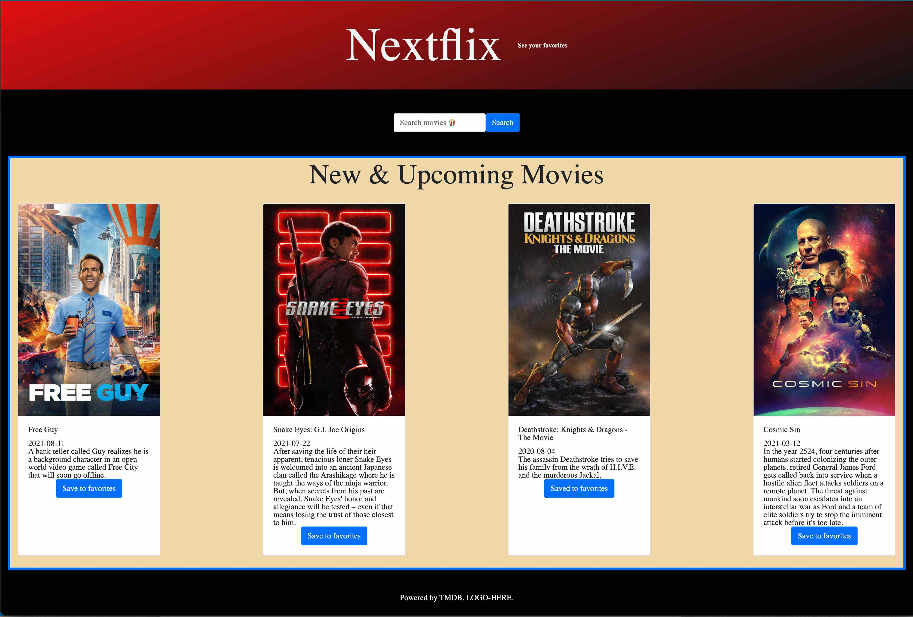
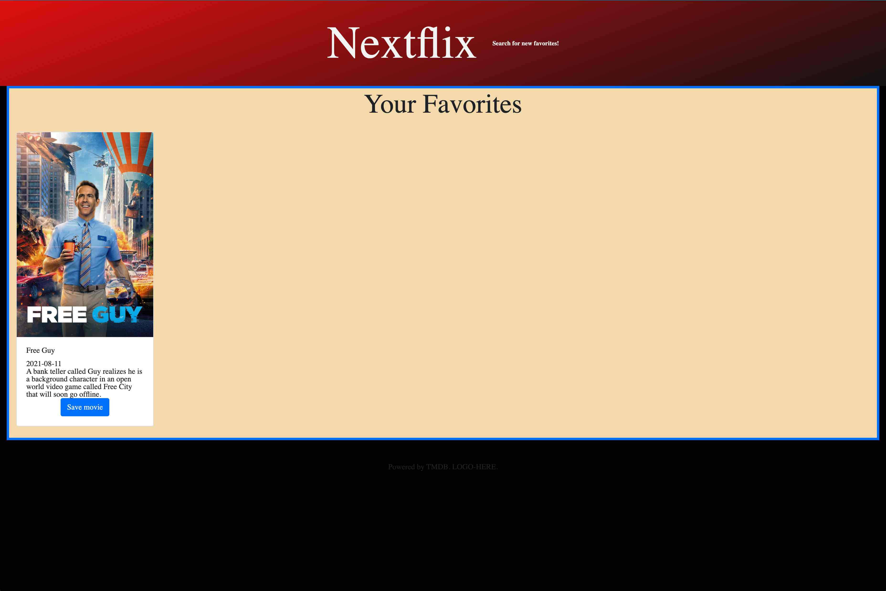

# nextflix

## Project Description
- User is able to see a short list of current movies that come from The Movie Database (TMDB) API.
- On the home page, user is able to search for movies based on their titles; i.e., if the user is searching for the movie "Halloween" they will see four results based on popularity.
- User is able to save a movie to their favorites list by clicking on the favorites button on the movie card.
- User can then see their favorites displayed on the favorites page by clicking the text link in the header navigation area "See your favorites."
- User can remove favorties from their favorites list by clicking on the remove button in the movie card on the favorites page.
- To search for new movies to add to their favorites, the user can click on the link or on the title element "Nextflix" to be taken back to the home page, where they can search for new titles.

## Screenshots

## Website link
https://cleadi.github.io/nextflix/
